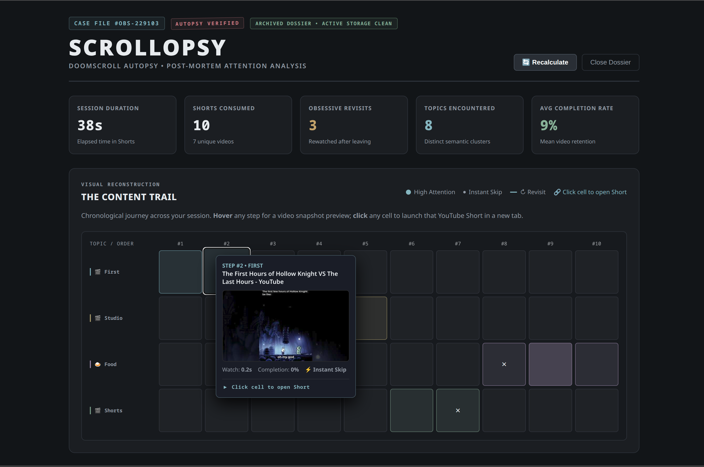
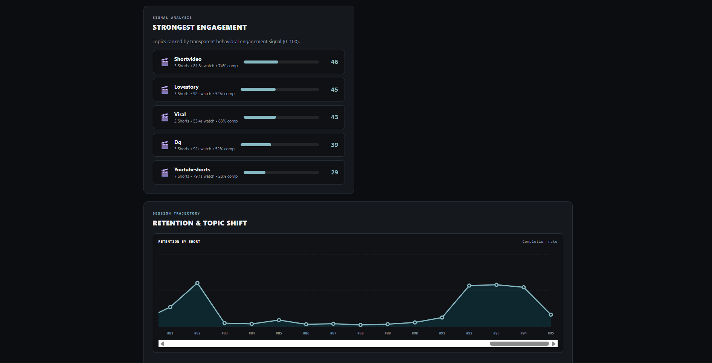
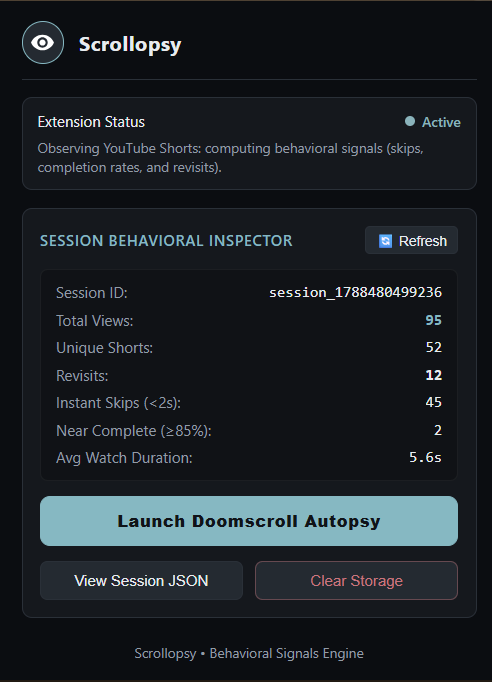

# Scrollopsy 🎯

## Basic Details
### Team Name: NOT NULL

### Team Members
- Member 1: Saivivek MV - College of Engineering Vadakara
- Member 2: Roshith Krishna KM - College of Engineering Vadakara 

### Project Description
Scrollopsy is a Chrome Extension that observes a user's YouTube Shorts scrolling session and creates an entertaining "autopsy" of their attention trajectory. It passively records viewing events, active watch durations, video completion rates, instant skips, and revisits.

### The Problem (that doesn't exist)
You open YouTube Shorts intending to watch one 15-second video, and suddenly it's 2 AM, your thumb has developed repetitive strain injury, and you have no idea how you transitioned from sourdough baking to competitive lawnmower racing.

### The Solution (that nobody asked for)
A digital "autopsy" of your doomscroll. Scrollopsy monitors your Shorts route changes and player state in real time, records your viewing duration down to the millisecond, calculates completion rates, detects when you frantically swipe past content in under 2 seconds, and tracks when you obsessively scroll back to rewatch a Short.

## Technical Details
### Technologies/Components Used
For Software:
- JavaScript (ES6+)
- Chrome Extensions Manifest V3 API (chrome.storage.local, content scripts, background service worker)
- HTML5 & CSS3
- Chrome DevTools

### Implementation

# Installation
1. Clone or download this repository.
2. Open Google Chrome and go to `chrome://extensions`.
3. Enable **Developer mode** using the toggle switch in the top-right corner.
4. Click **Load unpacked** and select this project directory.

# Run
1. Open [YouTube Shorts](https://www.youtube.com/shorts).
2. Scroll through Shorts normally.
3. Click the **Scrollopsy** extension icon in your browser toolbar to inspect live session stats (Total Views, Unique Shorts, Revisits, Instant Skips, Near Completes, and raw JSON).
4. (Optional) Open DevTools Console (`F12`) on YouTube to view real-time `[SCROLLOPSY]` tracking events (`VIEW START`, `VIEW END`, `WATCH DURATION`, `COMPLETION`).

### Project Documentation
For Software:

# Screenshots

*The main "Doomscroll Autopsy" dashboard interface, featuring a summary of overall session metrics*

*The detailed analysis section of the Scrollopsy dashboard*

*The Scrollopsy browser extension popup, displaying the active Session Behavioral Inspector with real-time statistics like total views, instant skips, and average watch duration, alongside the button to launch the full autopsy.*

---
Made with ❤️ at TinkerHub Useless Projects 

